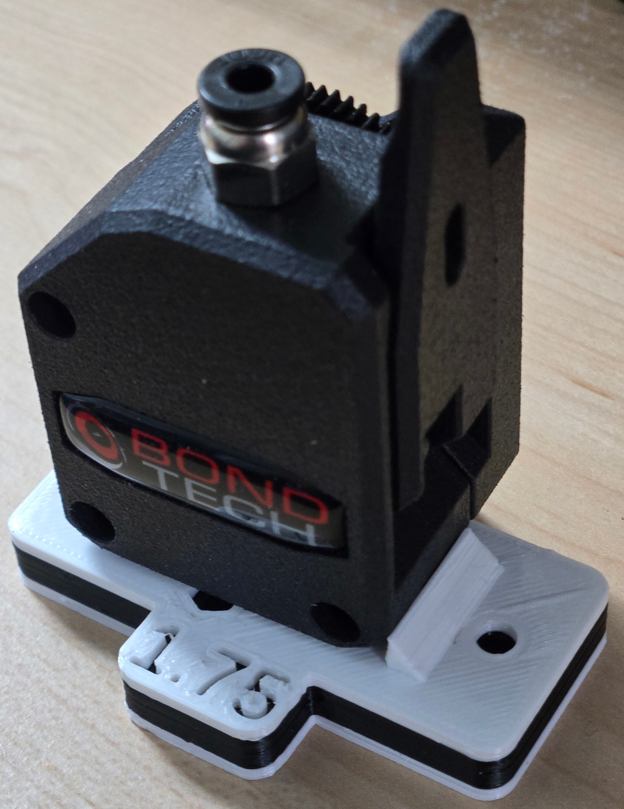
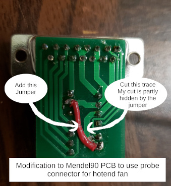
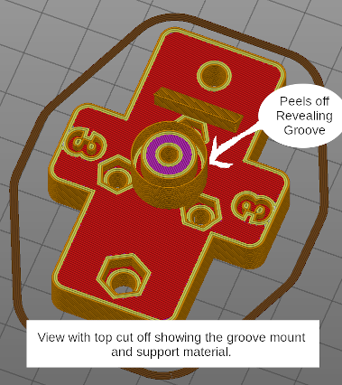

# BMG / Titan / Grove Mount to Wades Adapter

This is an adapter to attach an E3D Titan, Bondtech BMG or other compatible groove mount extruder to a Mendel90 or other carriage expecting a Wades extruder. This may work with other extruders/carriages with similar mounting styles. Many parameters may be changed, perhaps making it work with less similar printers and/or extruders. If you are only looking for a ready to print solution without customizing anything STLs are available on [Thingiverse](https://www.thingiverse.com/thing:4340787). The Thingiverse page also includes an STL for a modified Mendel90 d-motor mount allowing the original DB15 connector to be used with the new extruder.

**Notes:**

* The hotend bolts to bottom of adapter just like with a Wades extruder. No additional groove mount bracket is necessary.
* The hotend attaches with 3 M3 bolts/washers as per the Wades design. Typically M3 washers are 7mm in diameter. This makes the heads of the bolts close to the hotend. That is not a problem with older J-head style hotends. It can make it hard to reach the bolts with an Allan wrench with newer hotends that have wider heat sinks. 9mm M3 washers are also available though less common. The bolt holes in the attached STLs are spaced for 9mm washers. This makes it a little easier to get a wrench in. 7mm washers might not extend far enough into the groove. Washer size is a configurable parameter in the scad file.
* One weakness of this design is that the length of the hotend bolts must be exact. If they are too long they will extend into the extruder.  With the default parameters 11mm is about the right length. 
* ~~Another is that the nuts are plain nuts. It remains to be seen if with use the hotend screws loosen. If they do then perhaps Loctite or Nylocs would work.~~ **Update - after 2 years of use this has not been a problem.** I have avoided using Nylocs because that would require increasing the height of the bracket in order to make room for deeper nut wells.
* ~~I am using this with an all metal hotend that requires a fan. I did not want to run an extra wire for the fan. I am not using the probe connector on the PCB. Using a dremel I cut the trace between the probe connector and the thermistor ground. I then soldered a wire between that pin of the connector and the positive supply for the hotend and part cooling fan. At the other end of the ribbon cable I connected the wire that was supposed to be for the probe to ground. Then I connected the fan to what was supposed to be the probe connector and it is on whenever the printer is. This is not reflected in the first picture.~~ **Update** - After upgrading my heater and motor electronics but not the fans to 24V the PCB hack is no longer sufficient. There is no additional conductor for a second positive voltage source.  Instead I just ran a couple fan extension wires alongside the ribbon, clamping them within the ribbon clamps. It's kind of messy but it works for now. I have not had any problems with crosstalk.

**Printing:**

* Designed not to require slicer generated supports
* A thin support shell for the groove mount which removes easily may be optionally generated
* A thin support skin may be printed across the filament hole so as to make the ceiling of the hotend mounting hole
  all bridge, no overhang.
* Optionally, the top and bottom halves may be generated separately, to be glued together later. Or just held together by
  the mounting bolts. This eliminates the bridging over the hotend mounting hole and may make a better interface to the hotend.

**This design was based on:**

* The adapter Thomas Sanladerer designed for his [review](https://toms3d.org/2016/04/24/review-e3d-titan-as-a-super-light-extruder/
) of the Titan. 
* [Wades Geared Extruder](https://reprap.org/wiki/Wade%27s_Geared_Extruder)
* [Bondtech BMG extruder](https://www.bondtech.se/product/bmg-extruder/)
* The [E3D Titan](https://e3d-online.com/titan-extruder) Extruder
* And the [Mendel90](https://github.com/nophead/Mendel90) [RepRap](http://reprap.org)
